# Database Entity Relationship (ER) Diagram - HMS v2

This document provides a comprehensive visualization of the relationships between the database tables in the Hospital Management System (HMS v2).

---

## 1. Mermaid Entity Relationship Model

Below is the complete database structure showing the foreign keys, one-to-many, and one-to-one mapping cardinalities.

```mermaid
erDiagram
    Hospital ||--o{ Employee : "employs"
    Hospital ||--o{ Patient : "manages"
    Hospital ||--o{ OPDConsultation : "tracks"
    Hospital ||--o{ IPDAdmission : "tracks"
    Hospital ||--o{ Invoice : "issues"
    Hospital ||--o{ LabTestOrder : "records"
    Hospital ||--o{ PharmacyInvoice : "registers"
    Hospital ||--o{ OperationTheater : "books"
    Hospital ||--o{ BirthRegistration : "registers"
    Hospital ||--o{ DeathRegistration : "registers"
    Hospital ||--o{ PrintTemplate : "configures"

    Department ||--o{ Employee : "associates"
    Department ||--o{ OPDConsultation : "consults"
    Department ||--o{ IPDAdmission : "admits"

    Employee ||--|| Doctor : "extends 1:1"
    Employee ||--o{ Session : "authenticates"
    Employee ||--o{ Permission : "possesses"
    Employee ||--o{ Audit : "triggers"
    Employee ||--o{ OPDConsultation : "cancels"
    Employee ||--o{ IPDAdmission : "cancels"
    Employee ||--o{ OperationTheater : "completes"
    Employee ||--o{ OperationTheater : "cancels"
    Employee ||--o{ Payment : "receives"
    Employee ||--o{ Refund : "processes"
    Employee ||--o{ PharmacyPurchaseOrder : "receives"
    Employee ||--o{ PharmacyInvoice : "checks_out"
    Employee ||--o{ PharmacyInvoice : "cancels"
    Employee ||--o{ BedTransferHistory : "manages"
    Employee ||--o{ Invoice : "cancels"

    Patient ||--|| PatientAddress : "has 1:1"
    Patient ||--|| PatientEmergencyContact : "has 1:1"
    Patient ||--o{ PatientReferral : "referred"
    Patient ||--o{ OPDConsultation : "visits"
    Patient ||--o{ IPDAdmission : "admitted"
    Patient ||--o{ OperationTheater : "undergoes"
    Patient ||--o{ LabTestOrder : "submits"
    Patient ||--o{ RadiologyScanOrder : "submits"
    Patient ||--o{ BillableCharge : "charged"
    Patient ||--o{ Invoice : "billed"
    Patient ||--o{ PharmacyInvoice : "buys"

    BedRoom ||--o{ Bed : "contains"
    Bed ||--o{ IPDAdmission : "allocated"
    Bed ||--o{ BedTransferHistory : "transferred_from"
    Bed ||--o{ BedTransferHistory : "transferred_to"

    IPDAdmission ||--o{ BedTransferHistory : "tracks_transfers"
    IPDAdmission ||--o{ DoctorAssignmentHistory : "assigns_doctors"
    IPDAdmission ||--o{ OperationTheater : "books_ot"
    IPDAdmission ||--o{ BirthRegistration : "has_births"
    IPDAdmission ||--o{ LabTestOrder : "has_labs"
    IPDAdmission ||--o{ RadiologyScanOrder : "has_scans"

    Invoice ||--o{ InvoiceChargeMapping : "contains"
    BillableCharge ||--o{ InvoiceChargeMapping : "mapped_to"

    Invoice ||--o{ Payment : "settled_by"
    Invoice ||--o{ Refund : "refunded_from"
    Payment ||--o{ Refund : "reversed_by"

    LabTestCatalog ||--o{ LabTestOrder : "cataloged_as"
    LabTestOrder ||--o{ LabTestResult : "results"

    RadiologyScanCatalog ||--o{ RadiologyScanOrder : "cataloged_as"

    Medicine ||--o{ MedicineStock : "stocked_as"
    Medicine ||--o{ PharmacyPurchaseItem : "purchased"
    Medicine ||--o{ PharmacyInvoiceItem : "sold"

    PharmacyPurchaseOrder ||--o{ PharmacyPurchaseItem : "details"
    PharmacyInvoice ||--o{ PharmacyInvoiceItem : "details"
    PharmacyInvoice ||--o{ PharmacyReturn : "refunded"
```

---

## 2. Key Architecture Relationships

### 2.1. Tenant Isolation
Every operational business transaction table contains a `hospitalId` foreign key referencing the `Hospital` model. This establishes logical partitioning for multi-hospital instances without leaking cross-tenant records in joins.

### 2.2. Patient Normalization
Core identity statistics are placed in the `Patient` model. Supporting details are normalized into separate tables with a `1:1` mandatory constraint (`PatientAddress` and `PatientEmergencyContact`). This simplifies searching the patient registry without scanning heavy address blocks.

### 2.3. Staff & Doctors
All system users belong to the `Employee` model. Operational staff details, roles (`EmployeeRole` enum), and toggle permissions are held directly. Qualified doctors link `1:1` back to their parent `Employee` profiles, allowing uniform login mechanics across the hospital.

### 2.4. Financial Ledger Mapping
The billing engine stores active prices in `ChargeCatalog`. Actual transaction charges are mapped to the patient via `BillableCharge` records. When a statement is prepared, an `Invoice` is generated, mapping multiple `BillableCharge` rows through the `InvoiceChargeMapping` junction table, preventing race conditions or retroactive changes to billed metrics.
